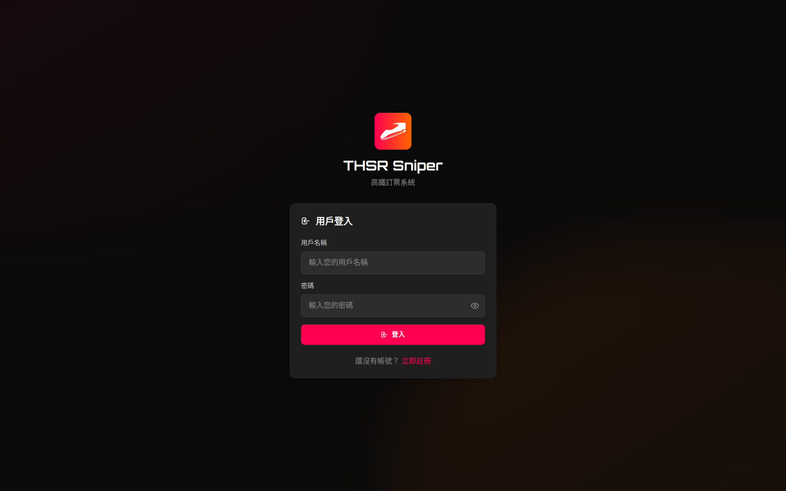
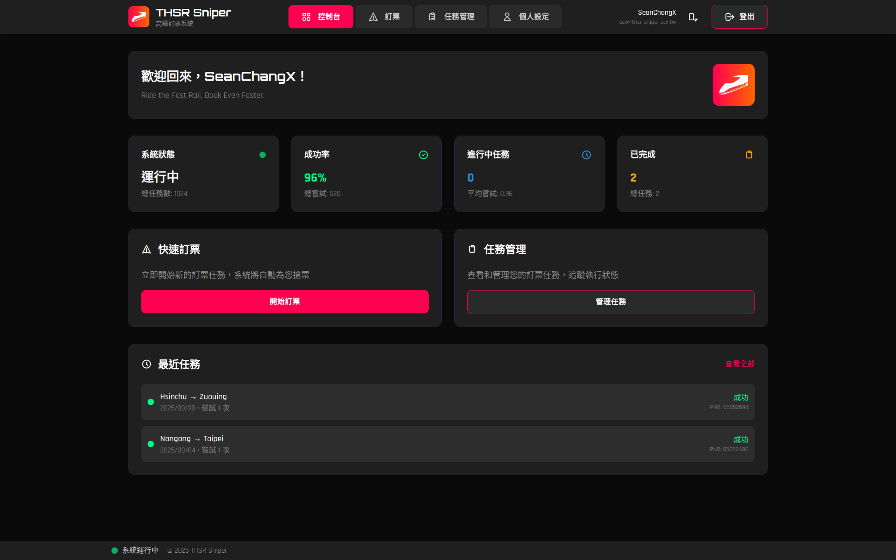
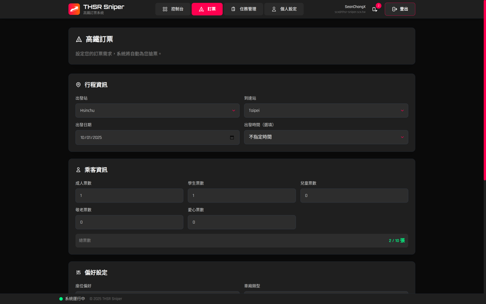
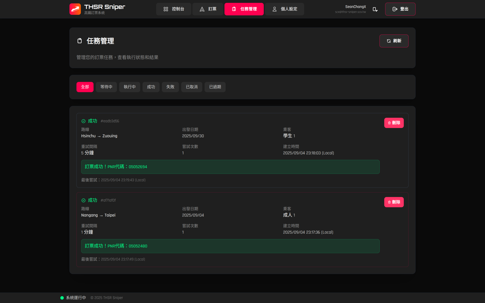

# THSR-Sniper

```

        ________  _______ ____              _____       _                
       /_  __/ / / / ___// __ \            / ___/____  (_)___  ___  _____
        / / / /_/ /\__ \/ /_/ /  ______    \__ \/ __ \/ / __ \/ _ \/ ___/
       / / / __  /___/ / _, _/  /_____/   ___/ / / / / / /_/ /  __/ /    
      /_/ /_/ /_//____/_/ |_|            /____/_/ /_/_/ .___/\___/_/     
                                                     /_/                 

# A comprehensive automated ticket booking system for Taiwan High Speed Rail (THSR)
# Features intelligent automation, OCR captcha recognition, API server, task scheduling,
# and multi-service architecture with Docker deployment support.
```

## Screenshots

<div align="center">
  
  
  <br>
  
  
</div>

## Quick Start

### Using Docker (Recommended)

```bash
# Clone the repository
git clone https://github.com/SeanChangX/THSR-Sniper.git
cd THSR-Sniper

# Build the services (optional)
docker compose build
```

### Environment Setup

#### Production Environment
For production use with optimized builds:
```bash
# Start production environment
docker compose up -d

# Services will be available at:
# - Frontend:   http://localhost:3000 [ Production ]
```

#### Development Environment
For frontend development with hot reload:
```bash
# Start development environment with Vite dev server
docker compose -f docker-compose.dev.yml up -d

# Services will be available at:
# - Frontend:         http://localhost:5173 [ Vite Dev Server ]
# - API server:       http://localhost:8000
# - Auth service:     http://localhost:8001
# - MySQL database:   http://localhost:3306
# - phpMyAdmin:       http://localhost:8080
```


### Three Operation Modes

#### 1. Immediate Booking (CLI Mode)
Direct booking with immediate execution:
```bash
# Interactive mode (guided experience)
docker compose run --rm thsr-sniper python main.py

# Command line mode (all parameters specified)
docker compose run --rm thsr-sniper python main.py \
  --from 2 --to 11 --date 2026/01/01 --time 20 \
  --adult 1 --seat 0 --class 0 --train 1 --id A123456789 --member n
```

#### 2. Scheduled Booking (API + Scheduler)
Automated periodic booking attempts with task management:
```bash
# Start the complete system (API + Scheduler + Watchdog)
docker compose up -d

# Schedule a booking task
docker compose exec thsr-sniper python main.py --schedule \
  --from 2 --to 11 --adult 1 --date +1 --id A123456789 --member n \
  --interval 5 --max-attempts 50

# Manage tasks
docker compose exec thsr-sniper python main.py --list-tasks
docker compose exec thsr-sniper python main.py --task-status TASK_ID
docker compose exec thsr-sniper python main.py --cancel-task TASK_ID
```

#### 3. API Server Mode
RESTful API for integration and web interfaces:
```bash
# Start only the API server
docker compose up -d thsr-sniper-api

# API will be available at http://localhost:8000
# Documentation at http://localhost:8000/docs
```

## Command Line Options

### Personal Information
- `--id, -i` - Personal ID number (required for booking)
- `--member, -m` - Use THSR membership (y/n, true/false, 1/0)

### Journey Details
- `--from, -f` - Departure station ID (use `--stations` to see list)
- `--to, -t` - Arrival station ID (use `--stations` to see list)
- `--date, -d` - Departure date (YYYY/MM/DD, YYYY-MM-DD, or relative: +1, +2, tomorrow)
- `--time, -T` - Departure time ID (use `--times` to see list)
- `--train, -r` - Train selection index (1, 2, 3...) from available trains list

### Ticket Configuration
- `--adult, -a` - Number of adult tickets (0-10)
- `--student, -s` - Number of student tickets (0-10)
- `--seat, -p` - Seat preference: 0=any, 1=window, 2=aisle
- `--class, -c` - Class type: 0=standard, 1=business

### Scheduler Options (API Mode)
- `--schedule` - Schedule booking for periodic execution (requires API server)
- `--interval` - Booking attempt interval in minutes (default: 5)
- `--max-attempts` - Maximum number of booking attempts (unlimited if not specified)
- `--list-tasks` - List all scheduled booking tasks
- `--task-status TASK_ID` - Show status of a specific task
- `--cancel-task TASK_ID` - Cancel a scheduled task

### API Server Options
- `--start-api` - Start the API server for web interface and task scheduling
- `--api-host` - API server host (default: 0.0.0.0)
- `--api-port` - API server port (default: 8000)

### Information & Utilities
- `--stations` - List all available stations with IDs
- `--times` - List all available departure times with IDs
- `--no-ocr` - Disable automatic captcha OCR recognition, use manual input only

## Date Format Support

The system supports multiple date input formats:

### Absolute Dates
- `2026/01/15` (YYYY/MM/DD)
- `2026-01-15` (YYYY-MM-DD)
- `01/15/2026` (MM/DD/YYYY)
- `15/01/2026` (DD/MM/YYYY)

### Relative Dates
- `+1` - Tomorrow
- `+2` - Day after tomorrow
- `+7` - Next week
- `tomorrow` or `tmr` - Tomorrow
- `today` or `now` - Today

## Station Reference

| ID | Station | ID | Station |
|----|---------|----|---------|
| 1  | Nangang | 7  | Taichung |
| 2  | Taipei  | 8  | Changhua |
| 3  | Banqiao | 9  | Yunlin  |
| 4  | Taoyuan | 10 | Chiayi  |
| 5  | Hsinchu | 11 | Tainan  |
| 6  | Miaoli  | 12 | Zuoying |

## Time Slots

The system provides 38 time slots throughout the day, from 00:01 to 23:30. Use `--times` to see the complete list with IDs.

## Docker Services

The system consists of multiple Docker services for a comprehensive architecture:

### Core Services

#### `thsr-sniper` (Main CLI)
Interactive CLI for immediate booking and task management:
```bash
docker compose run --rm thsr-sniper python main.py [options]
```

#### `thsr-sniper-api` (RESTful API Server)
Web API server with OpenAPI documentation:
```bash
docker compose up -d thsr-sniper-api
# API: http://localhost:8000
# Docs: http://localhost:8000/docs
```

#### `thsr-sniper-scheduler` (Background Watchdog)
Monitors and executes scheduled booking tasks:
```bash
docker compose up -d thsr-sniper-scheduler
# Automatically manages periodic booking attempts
```

## API Endpoints

### API Documentation
- **Interactive API Docs**: http://localhost:8000/docs
- **Auth Service Docs**: http://localhost:8001/docs

The REST API provides programmatic access to all booking features:

### Information Endpoints
- `GET /` - API information and status
- `GET /stations` - List all available stations
- `GET /times` - List all available time slots
- `GET /scheduler/status` - Scheduler status and statistics

### Booking Endpoints
- `POST /book` - Execute immediate booking (single attempt)
- `POST /schedule` - Schedule periodic booking task

### Task Management Endpoints
- `GET /tasks` - List all scheduled tasks
- `GET /tasks/{task_id}` - Get specific task status
- `DELETE /tasks/{task_id}` - Cancel a task
- `DELETE /tasks/{task_id}/remove` - Remove a task completely

### Results and Analytics
- `GET /results` - Get booking results with filtering
- `GET /results/stats` - Get booking statistics
- `GET /results/{task_id}` - Get detailed task result

## Usage Examples

### Immediate Booking Examples

#### Basic Booking
```bash
# Book one adult ticket from Taipei to Tainan
docker compose run --rm thsr-sniper python main.py \
  --from 2 --to 11 --adult 1 --id A123456789 --member n
```

#### Advanced Booking with All Options
```bash
# Book with specific train, seat preference, and business class
docker compose run --rm thsr-sniper python main.py \
  --from 1 --to 12 --date 2026/01/01 --time 10 \
  --adult 1 --seat 1 --class 1 --train 1 \
  --id A123456789 --member n
```

#### Student Tickets with Relative Dates
```bash
# Book student tickets for tomorrow
docker compose run --rm thsr-sniper python main.py \
  --from 5 --to 7 --student 2 --date +1 \
  --id A123456789 --member n
```

### Scheduled Booking Examples

#### Start the Complete System
```bash
# Start all services (API + Scheduler + Watchdog)
docker compose up -d
```

#### Schedule a Booking Task
```bash
# Schedule booking attempts every 5 minutes
docker compose exec thsr-sniper python main.py --schedule \
  --from 2 --to 11 --adult 1 --date +3 \
  --id A123456789 --member n --interval 5
```

#### Advanced Scheduled Booking
```bash
# Schedule with maximum attempts and specific preferences
docker compose exec thsr-sniper python main.py --schedule \
  --from 1 --to 12 --date 2026/01/01 --time 15 \
  --adult 2 --seat 1 --class 0 \
  --id A123456789 --member y \
  --interval 3 --max-attempts 100
```

### Task Management Examples

#### List All Tasks
```bash
docker compose exec thsr-sniper python main.py --list-tasks
```

#### Check Task Status
```bash
docker compose exec thsr-sniper python main.py --task-status abc12345-...
```

#### Cancel a Task
```bash
docker compose exec thsr-sniper python main.py --cancel-task abc12345-...
```

### API Usage Examples

#### Schedule Booking via API
```bash
curl -X POST "http://localhost:8000/schedule" \
  -H "Content-Type: application/json" \
  -d '{
    "from_station": 2,
    "to_station": 11,
    "date": "2026/01/01",
    "personal_id": "A123456789",
    "use_membership": false,
    "adult_cnt": 1,
    "interval_minutes": 5
  }'
```

### Information and Utilities

#### View Available Options
```bash
# List all stations
docker compose run --rm thsr-sniper python main.py --stations

# List all time slots
docker compose run --rm thsr-sniper python main.py --times
```

### Results Viewer
```bash
# View booking results
./view_results.sh

# View detailed results
./view_results.sh --details

# View specific user results
./view_results.sh --user 1 --details

# View successful bookings
./view_results.sh --status success
```

## Project Structure
```
THSR-Sniper/                    # Autonomous Taiwan High Speed Rail Booking System
├── 🐳 Docker Services
│   ├── docker-compose.yml      # Production multi-service configuration
│   ├── docker-compose.dev.yml  # Development environment with hot reload
│   └── Dockerfile              # Main application container definition
│
├── 🧠 Core Application (thsr_py/)
│   ├── __init__.py             # Package initialization with all modules
│   ├── api.py                  # FastAPI server with authenticated endpoints
│   ├── api_client.py           # API client with auto-Docker detection
│   ├── cli.py                  # Command line interface with modern banner
│   ├── flows.py                # Main booking logic and automation flow
│   ├── scheduler.py            # Intelligent task scheduling engine
│   ├── schema.py               # Data models and constants (stations/times)
│   └── watchdog.py             # Background service monitoring
│
├── 🛡️ Authentication Service (auth_service/)
│   ├── auth_api.py             # JWT authentication API server
│   ├── database.py             # MySQL user management
│   ├── security.py             # Password hashing and token validation
│   ├── requirements.txt        # Auth service dependencies
│   ├── Dockerfile              # Auth service container
│   └── data/                   # Database initialization scripts
│
├── 🎨 Frontend Interface (frontend/)
│   ├── src/                    # React + TypeScript source code
│   │   ├── components/         # UI components organized by feature
│   │   │   ├── Dashboard.tsx   # Main dashboard with stats and quick actions
│   │   │   ├── Layout.tsx      # App layout with navigation and auth
│   │   │   ├── auth/           # Authentication components (Login, Register)
│   │   │   ├── booking/        # Booking form and management components
│   │   │   ├── profile/        # User profile management
│   │   │   ├── tasks/          # Task monitoring and management
│   │   │   └── ui/             # Reusable UI components (Spinner, Notifications)
│   │   ├── services/           # API integration layer
│   │   │   └── api.ts          # API client with auth and endpoints
│   │   ├── store/              # State management (Zustand)
│   │   │   └── authStore.ts    # Authentication state management
│   │   ├── types/              # TypeScript type definitions
│   │   │   └── index.ts        # Shared interface definitions
│   │   ├── utils/              # Utility functions and helpers
│   │   │   ├── dateTime.ts     # Date formatting and timezone handling
│   │   │   └── stations.ts     # Station mapping and route formatting
│   │   ├── App.tsx             # Main app component with routing
│   │   ├── main.tsx            # Application entry point
│   │   ├── index.css           # Global styles with ROG gaming theme
│   │   └── vite-env.d.ts       # Vite environment type definitions
│   ├── public/                 # Static assets
│   ├── package.json            # Node.js dependencies and scripts
│   ├── vite.config.ts          # Vite build configuration with proxy
│   ├── tailwind.config.js      # Tailwind CSS with custom ROG theme
│   ├── postcss.config.js       # PostCSS configuration for Tailwind
│   ├── tsconfig.json           # TypeScript configuration
│   ├── tsconfig.node.json      # Node.js TypeScript configuration
│   ├── index.html              # HTML entry point with meta tags
│   ├── nginx.conf              # Production nginx configuration
│   ├── Dockerfile              # Production build container
│   ├── Dockerfile.dev          # Development container with hot reload
│   ├── .dockerignore           # Docker build exclusions
│   └── env.example             # Environment variables template
│
├── 🧠 ML Captcha Recognition (thsr_ocr/)
│   ├── captcha_ocr.py          # CNN+LSTM+CTC model training
│   ├── download_captcha.py     # Captcha image downloader
│   ├── prediction_model.py     # Optimized inference-only model
│   ├── test_model.py           # Accuracy testing and validation
│   ├── datasets/               # Training data and preprocessing
│   └── *.keras                 # Trained model files (95%+ accuracy)
│
├── 📊 Results & Analytics
│   ├── view_results_direct.py  # Direct database results viewer
│   ├── view_results.sh         # Enhanced Docker wrapper with auth
│   ├── main.py                 # Main entry point and CLI router
│   └── generate_keys.py        # Encryption key generator
│
├── 📁 Assets & Documentation  
│   ├── assets/                 # Project logos and branding
│   │   └── thsr-sniper-logo.svg
│   ├── README.md               # Comprehensive documentation
│   ├── requirements.txt        # Main Python dependencies
│   ├── LICENSE                 # MIT License
│   └── env.example             # Environment variables template
```

## Technical Details

### Captcha OCR System

- **Deep Learning Architecture**: CNN+LSTM+CTC model tailored for THSR captchas
- **Automatic Recognition**: Up to 3 attempts before manual input fallback
- **Model Specifications**: 160x50 grayscale input, THSR-specific character set
- **Training Pipeline**: Includes dataset management and model conversion tools
- **Integration**: Seamlessly integrated into booking flow with error handling

### Task Scheduling Engine

- **Persistent Storage**: JSON-based task serialization with atomic writes
- **Status Tracking**: Six task states (pending/running/success/failed/expired/cancelled)
- **Retry Logic**: Configurable intervals and maximum attempt limits
- **Concurrent Execution**: Thread-safe task processing with proper locking
- **Health Monitoring**: Watchdog service with automatic restart capabilities

### API Architecture

- **FastAPI Framework**: Modern Python web framework with automatic OpenAPI docs
- **RESTful Design**: Standard HTTP methods and status codes
- **Request Validation**: Pydantic models with comprehensive input validation
- **Error Handling**: Structured error responses with detailed messages
- **CORS Support**: Cross-origin resource sharing for web integration

## Disclaimer

**This software is provided for academic research and educational purposes only.**

- This is an unofficial implementation and is not affiliated with Taiwan High Speed Railway (THSR)
- Use at your own risk and discretion
- Users are responsible for compliance with applicable laws and regulations
- The developers assume no liability for any damages or legal issues arising from the use of this software
- This tool is intended for educational and research purposes in the field of web automation and CLI development
